# LP097QX1-SPC1 — LCD mechanical CAD reference

Mounting/mechanical geometry for the **LG Display LP097QX1-SPC1** 9.7" 2048×1536 LCD
panel (as used in iPad 3/4), extracted from the datasheet **FRONT VIEW** drawing for
designing cases, bezels and mounts.

Geometry was **re-traced from a colour-cleaned render** of the FRONT VIEW: the
datasheet page is rasterized and every non-geometry marking (dimension lines,
dash-dot centerlines, green active-area reference, page header) is stripped *by
colour*, leaving only the black/grey object outline. The outline, 4 lug ears and
holes are then traced from that clean image and self-calibrated to the
167.12 × 208.88 outline. Hole centers cross-check against an independent
dimension-line calibration to **< 0.1 mm**.

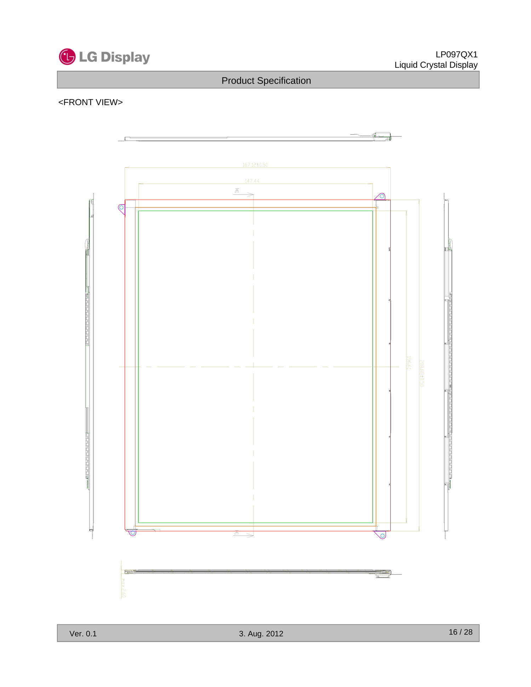

## Key dimensions (mm)

Datum = module-outline **center**, X → right, Y → up (front view as drawn).

| feature | size (W × H) | center offset | notes |
|---|---|---|---|
| Module outline | 167.12 × 208.88 (±0.5) | (0, 0) | thickness **2.60 max**; corners **R0.5**; **bottom-left non-square**: bottom edge raised to Y=−103.48 for X∈[−83.56,−65.8], ramps to full bottom (−104.44) by X=−62.7 |
| Bezel / polarizer | 151.608 × 201.01 | (−1.27, −0.86) | visible glass window |
| Active area | 147.456 × 196.608 | (−1.30, −0.89) | **not centered** |

### 4 mounting-lug holes — ⌀2.4 mm

| lug | X | Y | ear |
|---|---|---|---|
| TL | −85.71 | +99.55 | teardrop, points **left** (hole outside left edge) |
| TR | +78.07 | +106.59 | gusset, points **up** (hole outside top edge) |
| BL | −78.55 | −105.50 | teardrop, points **down** |
| BR | +78.48 | −107.34 | teardrop, points **down** |

> ⚠️ The lug layout is **asymmetric** (not a mirror set). Lugs protrude 3–5 mm past the
> 167.12 × 208.88 outline — your case must clear them.

**Z plane:** all 4 ears sit on the **front** (screen) face, Z 2.30–2.60 (thin 0.30 mm tabs).
The **rear FPC connector** is a keep-out boss on the **right long edge** (Y ≈ +26..+44),
protruding **~1.2 mm behind** the rear face (Z −1.20..0) — footprint approximate.

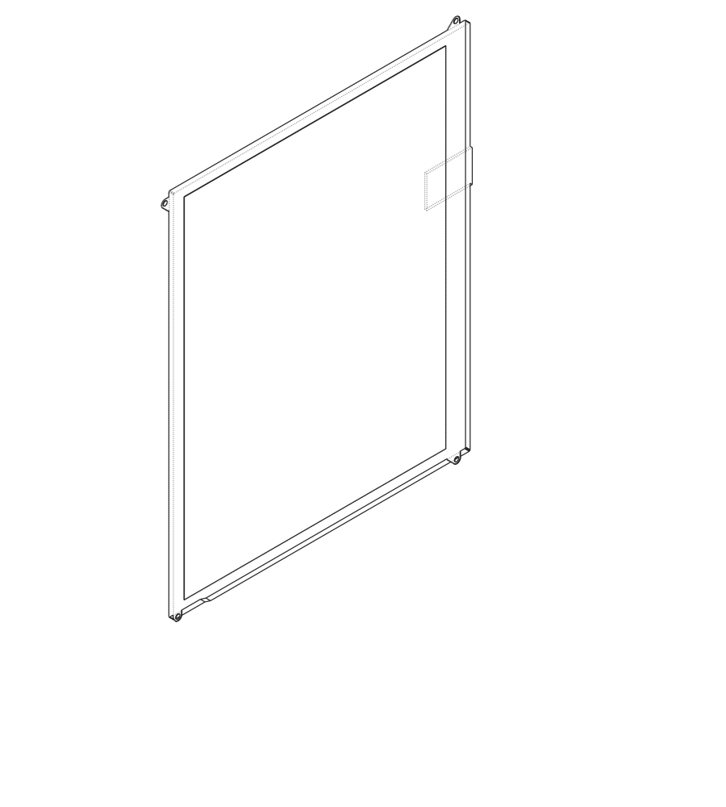

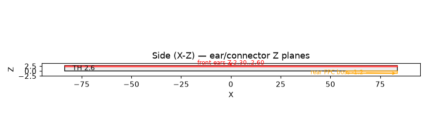

## Files

| file | description |
|---|---|
| `lcd_panel.step` | 3D solid: body + exact teardrop/gusset lug ears + ⌀2.4 holes + active-area pocket |
| `lcd_panel.stl` | mesh version of the above |
| `lcd_panel.scad` | parametric OpenSCAD source (all dims as variables) |
| `lcd_centerdatum.dxf` | 2D top view, origin = outline center, Y up |
| `lcd_cornerdatum.dxf` | 2D top view, origin = outline top-left, Y down (drawing convention) |
| `lcd_sideprofile.dxf` | side (Z) section: thickness 2.60, lug front plane, active recess |
| `lcd_lugs.csv` | hole coordinates, both datums |
| `lcd_reference.txt` | full numeric reference |
| `geometry.json` | **single source of truth** — clean-traced outline, ears, holes, bezel, Z, connector |
| `build_step.py` | builds the STEP/STL from `geometry.json` (needs cadquery) |
| `make_clean.py` | strips markings by colour + rasterizes the clean render |
| `trace2..6.py`, `geom.py` | trace pipeline (silhouette → edges → ears → holes → `geometry.json`) |
| `make_outputs.py` | regenerates the DXF/SCAD/CSV/reference/images |
| `verify.py` | overlays `geometry.json` back on the clean render |
| `bracket_top.step` / `.stl` | top photo-frame mounting bracket (3D print) |
| `bracket_bottom.step` / `.stl` | bottom photo-frame mounting bracket (3D print) |
| `bracket_top_thin.stl` / `bracket_bottom_thin.stl` | 5 mm-thick test-print variants (same XY/fit) |
| `build_brackets.py` | builds the two brackets from `geometry.json` + frame params (cadquery) |
| `brackets.scad` | parametric OpenSCAD source for the brackets |
| `verify_brackets.py` | assembly + side-section check images for the brackets |
| `passepartout.dxf` | mat cut lines (BOARD / WINDOW_SCREEN / WINDOW_GLASS layers) |
| `passepartout.py` | builds the mat drawing + DXF (180×240, 45° bevel window = screen) |
| `LP097QX1-SPC1.pdf` | source datasheet (© LG Display) |

DXF layers: `OUTLINE`, `BEZEL`, `ACTIVE`, `HOLES`, `HOLE_CENTERS`, `EARS`, `CONNECTOR`.

### Lug ear shapes
Traced silhouettes (red) + ⌀2.4 holes (green) over the colour-cleaned drawing:

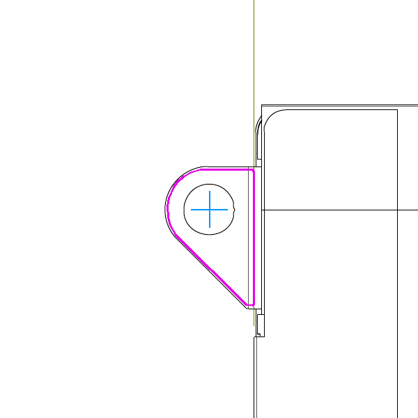 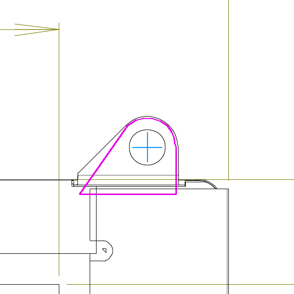 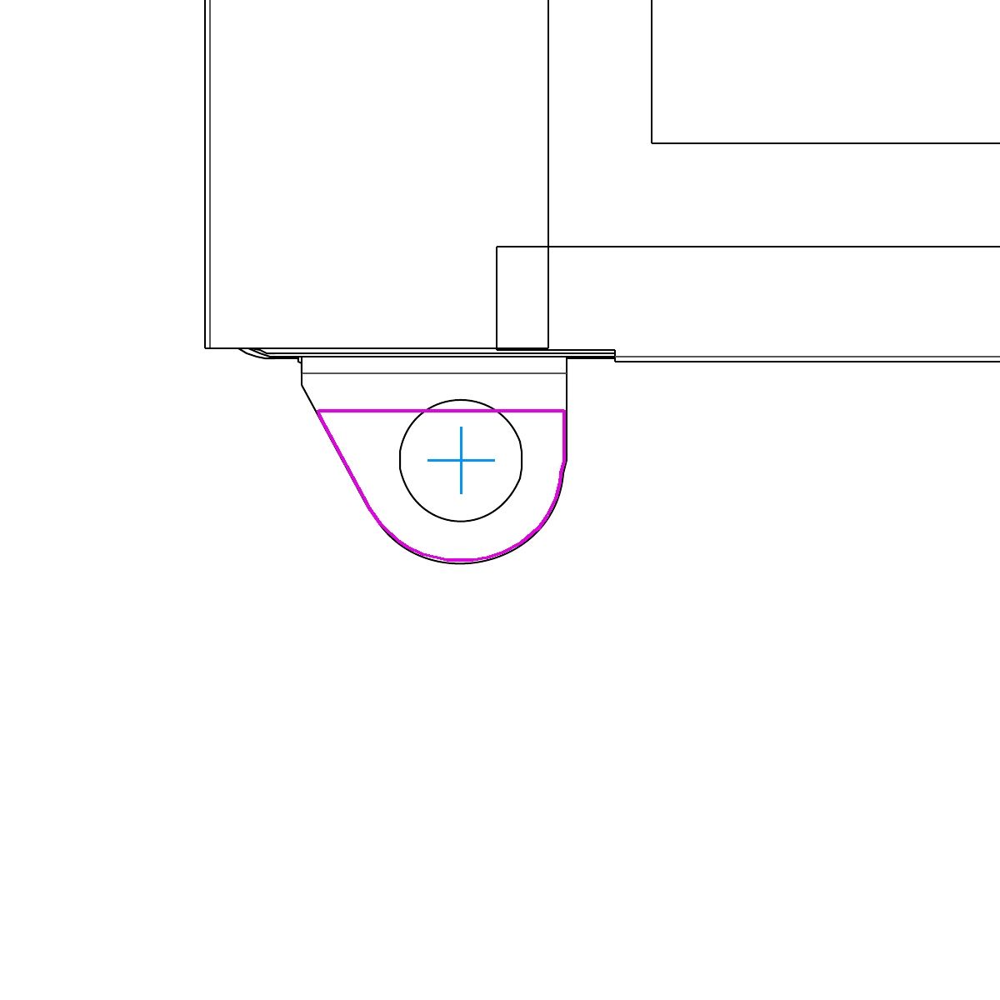 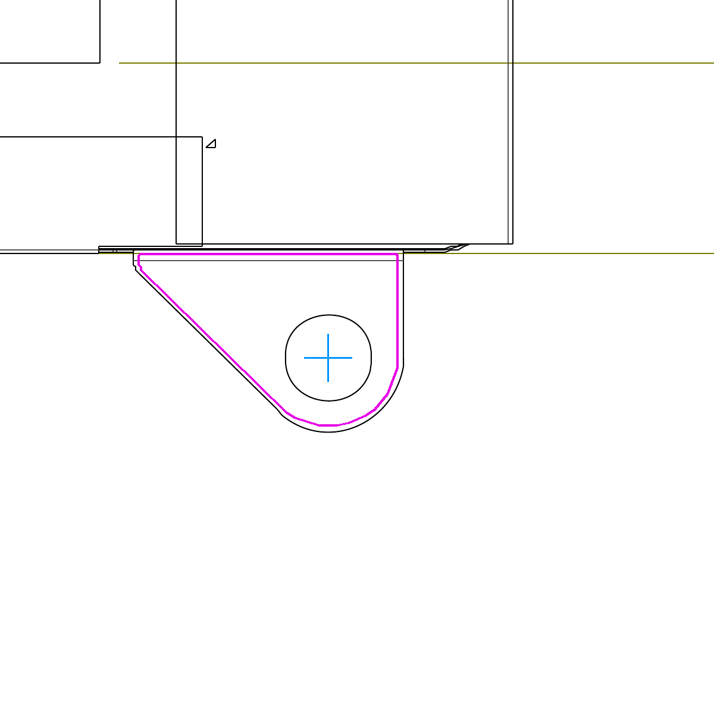

Lugs are **thin flat sheet-metal tabs (0.30 mm)** — not full-thickness — all on the
**front** (screen-side) face.

## Regenerate the 3D model

```bash
python3 -m venv cqenv
cqenv/bin/pip install cadquery cairosvg opencv-python-headless scipy
cqenv/bin/python build_step.py      # geometry.json -> lcd_panel.step + lcd_panel.stl
cqenv/bin/python make_outputs.py    # -> DXF / SCAD / CSV / reference / images
```

Re-trace from the PDF: `make_clean.py` → `trace2..6.py` → `geom.py` (writes `geometry.json`),
then `verify.py` overlays the result on the clean render. Or render the parametric source with
OpenSCAD: `openscad -o lcd_panel.stl lcd_panel.scad`.

## Photo-frame mounting brackets

Two **3D-printable back-press brackets** that hold the panel **centered in a photo frame** whose
inner cavity is **182 (W) × 242 (H) mm**. They sit on the panel's **short sides** (top + bottom),
friction-fit between the frame side walls. There is **no lip in front of the panel** — the screen
sits **flat on the frame glass**; the panel slides into a **2.75 mm slot** (2.60 LCD + 0.15) with the
rear shelf **behind** it, and the frame backing pushes the bracket so the shelf presses the LCD onto
the glass.

They **center the VIEW (active) area, not the outline.** The active area is offset from the
outline center by (−1.30, −0.89), so the panel is shifted (+1.30, +0.89) and the brackets are
sized to suit — the image lands in the frame center.

| | value |
|---|---|
| Frame inner cavity | 182 × 242 mm |
| Top-bracket gap (Y-depth) | **15.67 mm** |
| Bottom-bracket gap (Y-depth) | **17.45 mm** |
| Left / right gap (open, no bracket) | 8.74 / 6.14 mm |
| Bracket length (X, friction) | 181.8 mm (182 − 0.2) |
| Total thickness (Z) | 15.0 mm (screen on glass; rear shelf 2.75 → 15) |
| Panel slot (Z) | 2.75 mm = 2.60 LCD + 0.15 clearance; shelf sits **behind** the LCD |
| Rear shelf overhang onto border | 3.0 mm (clear of the active area) |

Check: 15.67 + 208.88 + 17.45 = 242.0 ✓. The lug ears are on the LCD **front** (recessed ~0.25 mm),
so each bracket's **ear-clearance pockets are cut on the front (glass) face** (top: TL+TR, bottom:
BL+BR). This **shape-keys** the part — it only seats with the ears in the front pockets (glass side),
which keeps the rear shelf behind the LCD, pressing it **from behind onto the glass**. The two
brackets are **different parts** (gaps and ear pockets differ).

**Thin test-print variants** (`bracket_top_thin.stl`, `bracket_bottom_thin.stl`, Z = 5 mm) have the
same XY/fit/slot/ear pockets — print one fast/cheap to check fit + orientation before the full 15 mm
part. Ear pockets are placed at each tab's **actual** position (the asymmetric layout: TL left-edge,
TR top-edge, BL/BR bottom-edge), with **1.5 mm clearance** all round — see the coverage check below.
Pockets + outline are **`MIRROR_X`-handed to match the physical panel** (see Handedness above).

Each bracket's total depth into the cavity is the end-gap **plus** the 3 mm shelf overhang behind the
LCD border (top 15.67+3.0, bottom 17.45+3.0), all behind the screen — the active area stays clear.

**Handedness:** the datasheet **FRONT VIEW is mirrored left-right vs the physical panel**, so the
brackets are built with **`MIRROR_X=True`** to match the real part. Front view (screen toward you):
the prominent angled lug is at the **top-right**, the single up-poking lug at the top-left, two lugs
on the bottom edge. (Set `MIRROR_X=False` to follow the raw datasheet handedness instead.)

### Orientation (important)
The part is nearly symmetric front-to-back, so it has an explicit key: the flat rear face is
**debossed "BACK"**. That face goes against the **frame backing**; the opposite face — with the open
slot + ear pockets — goes against the **glass / LCD**. The rear shelf then sits behind the LCD and the
frame backing presses it **from behind onto the glass**.

- **Print** the flat **"BACK"** face on the bed (slot + pockets facing up) → the rear-shelf overhang
  prints support-free. The bed face is the frame-backing face.
- **Assemble:** frame face-down on the glass; LCD in screen-first (rests on glass); push each bracket
  into its end gap **pocket/open face toward the glass** (the "BACK" deboss faces out, toward you) so
  the rear shelf sits behind the LCD edge; close the frame back — its clamping seats the LCD on the glass.

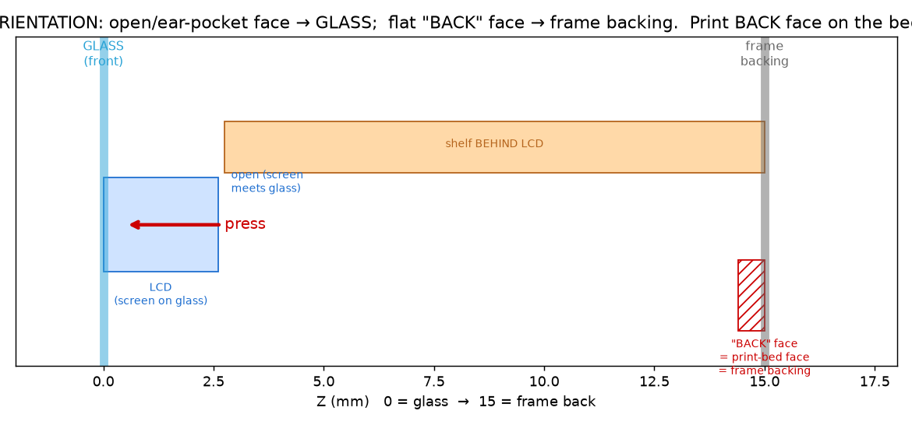
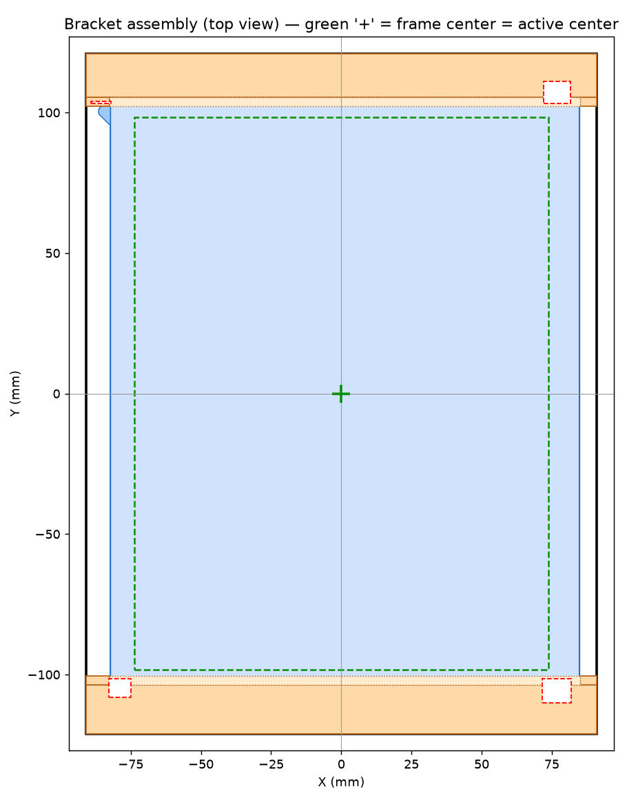
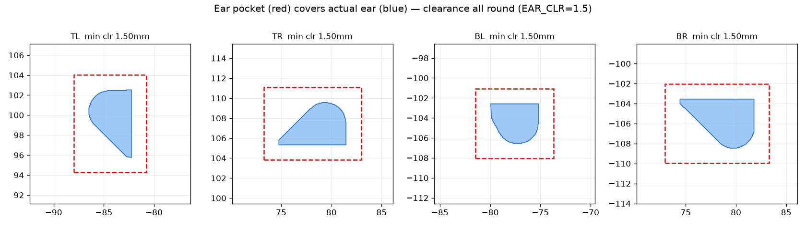
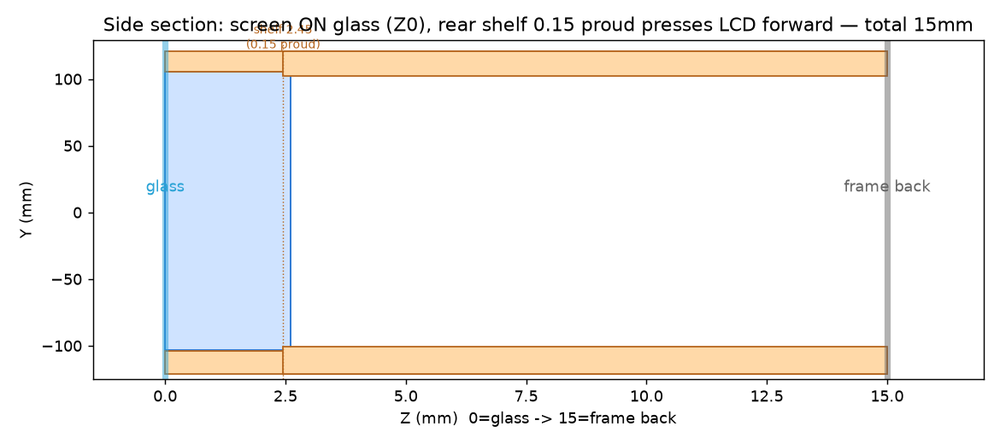

**Print:** PLA/PETG, lay flat — no supports. **Tune the fit** at the top of `build_brackets.py` /
`brackets.scad`: `FIT_CLR` (frame friction), `SEAT_CLR`/`POCKET_CLR` (panel play), `SLOT_CLR`
(panel slot Z — lower for tighter glass contact, raise if the LCD is tight), `EAR_Z` (front ear-pocket
depth), `LIP_Y` (rear-shelf grip), `MIRROR_X` (flip handedness), `LABEL` (the "BACK" deboss).
`VIEW_CENTER=False` centers the outline instead (equal 16.56 mm gaps). (Assembly + print orientation
are covered in **Orientation** above.)

```bash
cqenv/bin/python build_brackets.py     # -> bracket_top/bottom .step + .stl
cqenv/bin/python verify_brackets.py    # -> images/brackets_assembly.png + brackets_section.png
# or parametric: openscad -o bracket_top.stl -D 'part="top"' brackets.scad
```

## Passe-partout (mat window)

A **180 × 240 × 1.4 mm** mat with a centred **45° bevel** window that reveals only the **active
screen** (147.456 × 196.608). The brackets centre the active area at the frame centre, so the window
is **centred** in the board (symmetric — equal borders).

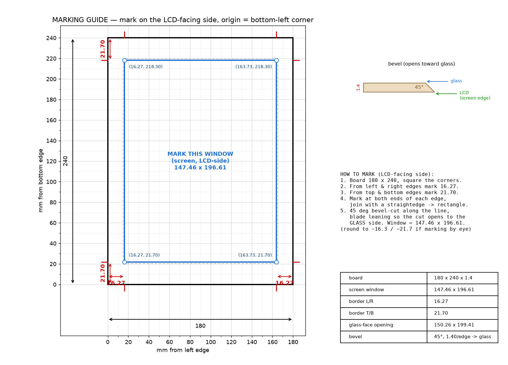

**Bevel opens toward the glass/viewer** — the screen-sized (limiting) edge is on the **LCD-facing
(back) face**, sitting right at the screen plane; the 45° bevel flares **1.4 mm/edge toward the glass**
so the white bevel faces you.

| feature | mm |
|---|---|
| Board (outer) | 180 × 240 × 1.4 |
| **Screen window** (visible crop, on LCD-side face) | **147.46 × 196.61** (= active screen) |
| LCD-face border — L/R, T/B | **16.27**, **21.70** |
| Glass-face opening (larger, bevel mouth) | 150.26 × 199.41 |
| Glass-face border — L/R, T/B | 14.87, 20.30 |
| Bevel | 45°, run 1.40 mm/edge, opens toward glass |

**Hand-marking** (`images/passepartout.png` is a ruler/pencil guide): on the LCD-facing side, from
**each** edge measure **16.27 mm** (left/right) and **21.70 mm** (top/bottom), mark at both ends of
every edge, join with a straightedge → the 147.46 × 196.61 rectangle, then 45° bevel-cut. Window
corners from the bottom-left corner: **(16.27, 21.70)**, **(163.73, 21.70)**, **(16.27, 218.30)**,
**(163.73, 218.30)**.

- The **screen-sized opening is on the LCD side** (147.46 × 196.61) and crops exactly to the screen;
  the bevel widens to **150.26 × 199.41** at the glass face. White bevel faces the viewer.
- Manual cutter: cut so the **small (screen-sized) opening is on the LCD-facing side**; the 45° bevel
  mouth opens toward the glass. `WINDOW_SCREEN` in the DXF is the crop edge, `WINDOW_GLASS` the mouth.
- Set `BEVEL_TOWARD="lcd"` in `passepartout.py` for the standard picture-mat direction (screen edge on
  the glass face instead). `OVERLAP=1.0` covers ~1 mm of the screen edge (no bezel sliver).
- Board 180 × 240 sits in the 182 × 242 frame with ~1 mm clearance/side — keep it centred so the
  window lines up with the (centred) screen.

## Accuracy

- Outline = datasheet nominal (167.12 × 208.88); model self-calibrated to it.
- Hole centers: ≈ ±0.05 mm relative, ≈ ±0.1 mm vs the independent dimension-line calibration.
- Ear silhouettes are traced from the clean render (≈ ±0.1 mm, drawing-scale limit).
- Datasheet's own outline tolerance is ±0.5 mm.
- Lug ears are **thin flat sheet-metal tabs (0.30 mm)**, all on the **front** (screen) face
  (Z 2.30..2.60), confirmed against the physical part.

## Source

Datasheet: LG Display LP097QX1-SPC1, mirrored at
<http://mikesmods.com/mm-wp/wp-content/uploads/2013/04/LP097QX1-SPC1.pdf>
(FRONT VIEW, printed page 16/28). The PDF is © LG Display, included here for reference.

Extracted geometry and CAD files in this repo are provided as-is, no warranty — verify
against the datasheet before manufacturing.
